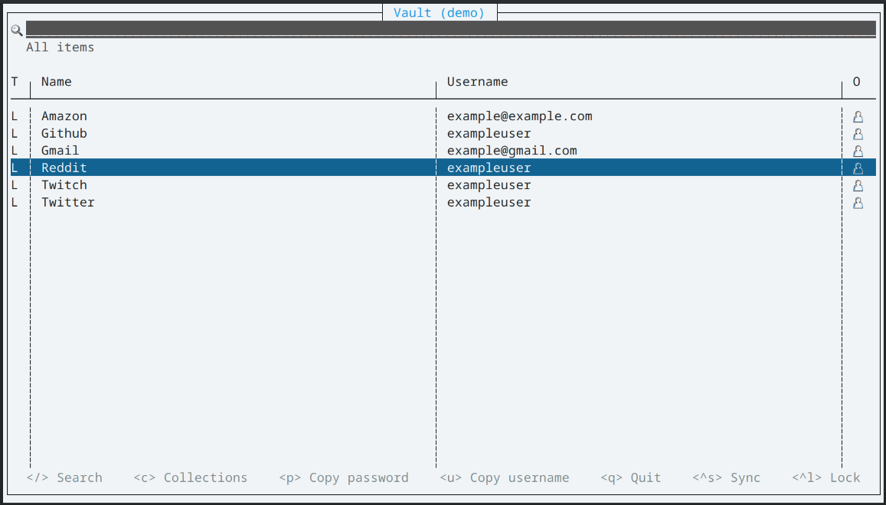

# wden

A read-only TUI for accessing Bitwarden vault contents from the terminal.

**WARNING: This application is experimental and has not been audited. Use at your own risk.**

This project is not associated with the Bitwarden project nor Bitwarden Inc.



---

## Usage

```
Usage: wden [OPTIONS]

Options:
  -p, --profile <PROFILE>  Sets the profile that will be used [default: default]
      --list-profiles      Instead of starting the application, list all stored profiles
  -h, --help               Print help (see more with '--help')
  -V, --version            Print version

Server options:
      --bitwarden-cloud-region <BITWARDEN_CLOUD_REGION>
          Sets the current profile to use the given Bitwarden cloud server region [possible values: us, eu]
  -s, --server-url <SERVER_URL>
          Sets the current profile to use the given server url (single host)
      --api-server-url <API_SERVER_URL>
          Sets the current profile to use the given API server url. This needs to be set with --identity-server-url
      --identity-server-url <IDENTITY_SERVER_URL>
          Sets the current profile to use the given identity server url. This needs to be set with --api-server-url

API Keys:
      --api-key-client-id <API_KEY_CLIENT_ID>          Client secret of Bitwarden API key
      --api-key-client-secret <API_KEY_CLIENT_SECRET>  Client ID of Bitwarden API key
      --api-key-login-email <API_KEY_LOGIN_EMAIL>      Email address of the API key account

Advanced options:
      --accept-invalid-certs  Danger: Accept invalid and untrusted (e.g. self-signed) certificates
```

### With Bitwarden Cloud

Just run the wden binary.
```
./wden
```

Wden will create a new profile (named `default`), with the Bitwarden Cloud US region configured as the server.

To use the EU region, launch wden with the `--bitwarden-cloud-region eu` option.

### With a self-hosted Bitwarden-compatible server

Run the wden binary, and set the server URL with the `-s` flag. The flag has to be passed only on the first launch, because wden will store the server URL in the configuration.

```
./wden -s https://my-own-bitwarden.example.com
```

Wden will create a new profile (named `default`) with the given server URL.

### With multiple profiles

Multiple profiles with different settings can be used when connecting to multiple Bitwarden instances or with multiple users. For example, this allows quickly accessing a personal and a work Bitwarden vault. Wden will remember configuration values (server URL, lock timeout, ...), login email addresses and two-factor logins separately for each profile.

When launching wden, specify the profile name with the `-p` flag. The name may only include lowercase characters (`a-z`), digits, dashes and underscores. The server URL may be set with the `-s` flag on the first launch, but it's not necessary on subsequent launches.

```
./wden -p personal -s https://my-own-bitwarden.example.com
```

All existing profiles can be listed with the `--list-profiles` parameter.

### Configuration files

Configuration files, one for each profile, are stored under the user's config directory (by default, `~/.config/wden` on Linux and `%appdata%\wden` on Windows).

---

## Features

- Listing Login, Identity, Card, and Note items
- Copy usernames and passwords
    - Bypasses clipboard history in Windows and KDE Plasma
- View organization items
- Fuzzy search
- 2FA login (only authenticator code apps and email supported as 2FA methods)
- Connect to self-hosted Bitwarden-compatible instances (configurable URLs)
- Automatic vault locking after a configurable period
- Multiple profiles (configurations)

## Todo

- Folder support
- Local vault caching / offline support?
- Attachment support
